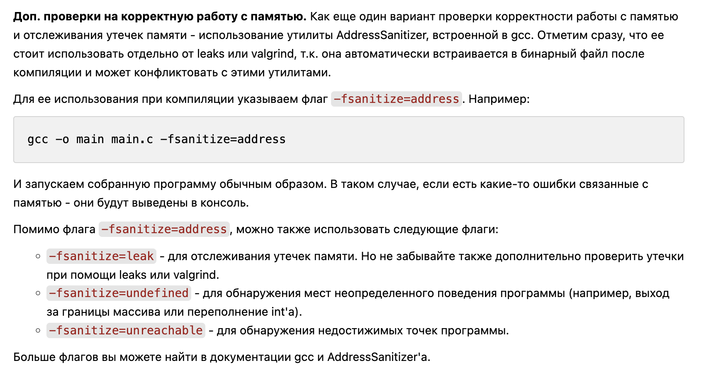
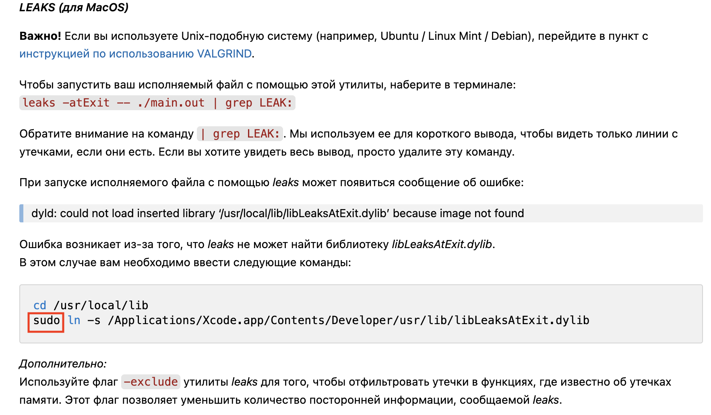
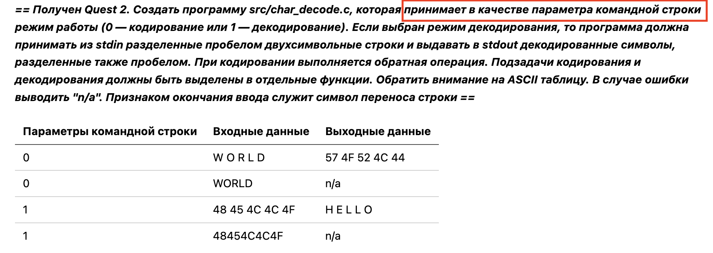
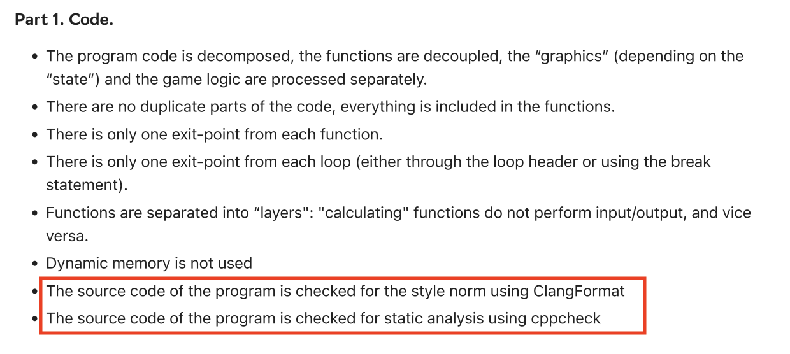
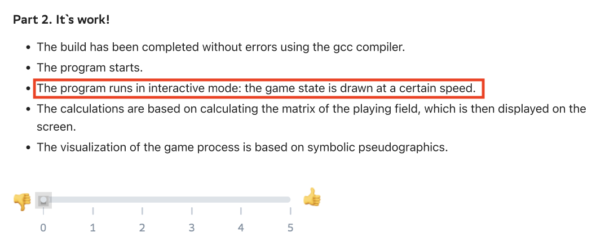
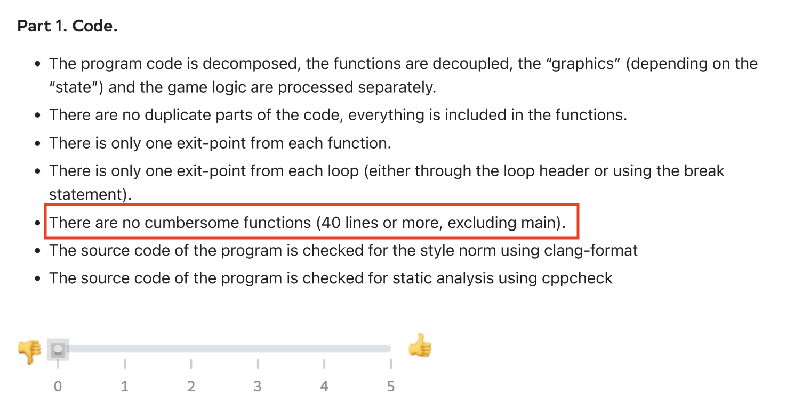
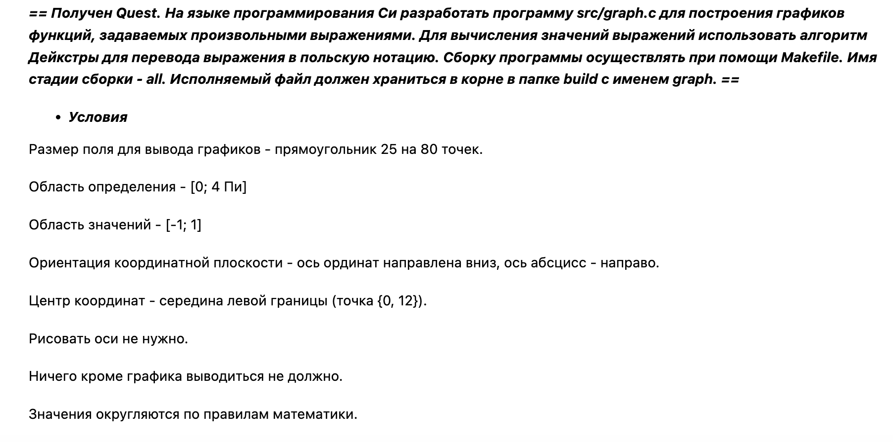
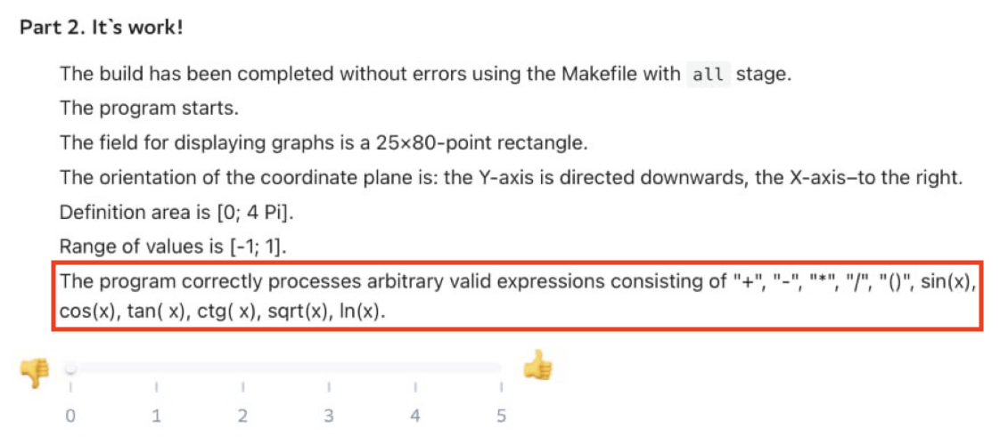

# FROM_STAFF_TO_PRODUCT

Данный файл содержит информацию про некорректные формулировки в групповых проектах интенсива, из-за которых возникают спорные ситуации на staff-проверках, а также решения как можно было бы решить эту проблему.

## Проблемы, касающиеся всех проектов

  ### 0. Фото в applicant.21-school.ru
  #### Проблема:
  Перед началом проверки проверяющие должны идентефицировать пиров, которые приходят на проверку для того, чтобы убедиться, что проверяем именно тех пиров, которые заявлены в проверке.
  #### Возможное решение:
  - Исправить мобильную версию сайта, вернуть возможность проверять фото

  ### 1. fsanitize
  #### Проблема:
  В репозиториях указана дополнительная проверка на корректную работу с памятью, которая указывает, что мы можем использовать fsanitize, но при использовании её на Mac в Москве выдает ошибку компиляции.

  
  *instructions_for_testing_rus.md*
  #### Предлагаемые решения:
  - Убрать из репозиториев упоминание об fsanitize.

  или

  - Исправить компиляторы в кампусе.

  ### 2. valgrind
  #### Проблема:
  В репозиториях указано, что для проверки тестов на корректную работу с памятью можно использовать ***valgrind***, но его нельзя использовать на OS X и рекомендуется использовать утилиту ***leaks***. Но ***leaks*** показывает только утечки в памяти (непочищенную память) и не показывает ошибки работы с памятью (выход за границу массива, работа с неиницилизированными переменными), что не дает полноценно бассейнистам проверить проект, а на staff-проверках проверяющие используют ***valgrind***, разворачивая docker-контейнер для этой проверки.

  
  *instructions_for_testing_rus.md*
  #### Предлагаемые решения:
  - Сделать дополнительую инструкцию с разворачиванием docker-контейнера, где они бы могли тестировать с помощью ***valgrind***.

  ### 3. leaks
  #### Проблема:
  В *instructions_for_testing_rus.md* есть упоминание команды с `sudo`, которая априори не будет работать на машинах в кампусах. Пиры обращаются к волонтерам с просьбой помочь, на что они получают ответ, что у них нет прав, в свою очередь они задаются вопросом зачем тогда про это пишется.

  
  *instructions_for_testing_rus.md*
  #### Предлагаемые решения:


  ### 4. system
  #### Проблема:
  Cистемные вызовы обращаются напрямую к ядру системы и не являются безопасными, они уменьшают портируемость программ т.к. на разных ОС вызовы могут отличаться своей работой, либо не позволят скомпилировать код. Пиры часто приходят с кодом, который содержит вызов такого вида: `system("clear")`, `exit(0)`. Они говорят, что запрета на использование этих вещей нет, возникает много споров между проверяющими и пирами, проверяющие все равно ставит флаг, а у пиров портится впечатление.

  #### Предлагаемые решения:
  - Добавить запрет на использование системных вызовов (system() и ему подобные, библиотеки sys/*.h, exit()) в ридми первых проектов на C.

  ### 5. Функциональность проекта
  #### Проблема:
  Проверяющие иногда встречаются с такими проектам, которые компилируются, запускаются и не выполняют даже минимальные требования к проекту (например, есть только отрисовка поля или вывод нескольких графиков) или в принципе ничего не выполняют. Если выставлять оценки согласно чеклисту, то пиры получают какие-то минимальные баллы и зеленый проект.
  Пример: пришла команда, у которой фактически нет алгоритма Дейкстры. Максимум, строка на лексемы парсится. Однако, в части отрисовки они всегда рисуют график функции sin(cos(2x)). То есть, при любом вводе программа выводит данный график. По checklist это проходит все, кроме одного, пункты в Part 1, но также проходит и все пункты в Part 2 кроме последнего. Пункта, который проверяет корректность сборки и работы программы. За такую программу команда получает 4/4/0 и зеленый проект, согласно checklist.

  #### Предлагаемые решения:
  - Добавить отдельный флаг за нефункциональность проекта.
  
  или 

  - Изменить чеклисты.

  ### 6. Флаги
  #### Проблема:
  Флаг "**forbidden function**" выдает подсказку "использование запрещенных библиотек и функций", что вызывает спорные ситуации, когда пиры видят эту самую подсказку. Например, такого рода: "Указатель — это не функция, а оператор! Почему я получаю этот флаг?".

  #### Предлагаемые решения:
  - Изменить флаг "**forbidden function**" на "**forbidden syntax**".

## P01D06 Pong

  ### 1. Указатели
  #### Проблема:
  В условиях проекта указано, что пирам нужно выполнить проект в рамках изученного материала. Предполагается, что проекты не должны содержать функции, параметры которых содержат указатели. Но пиры говорят, что они использовали указатели в рамках выполнения *T04D04 Quest 2* (в данном квесте используются указатели для параметров командной строки). Также возникают долгие споры между пирами и проверяющим.

   
  *T04D04/README_RUS.md*
  
   
  *P01D06/README_RUS.md*
  
  #### Предлагаемые решения:
  - Изменить *T04D04 Quest 2*, например, перенести параметры командной строки во входные данные, так как там используются указатели и строки, которые пир проходят только на 2 и 3 неделях соответственно. 
  
  и
  
  - Добавить явный запрет на использование указателей в раздел "**Важные замечания**" в *P01D06/README_RUS.md*.

  ### 2. Массивы
  #### Проблема:
  В условиях проекта указано, что пирам запрещено использовать динамическую память, но как такового запрета на использование массивов нет. Также пиры частенько трактуют, что массивы это не указатели, так как массив объявляется `int data[25][80]`, а указатели `int *data`.

   
  *P01D06/README_RUS.md*

  #### Предлагаемые решения:
  - Добавить явный запрет на использование массивов в раздел "**Важные замечания**" в *P01D06/README_RUS.md*.

  ### 3. Бонусная часть
  #### Проблема:
  В условиях бонусной части бассейнистам разраешается использовать дополнительные библиотеки для упрощения обработки действий игроков и отображения символьной графики. 
  
   
  *P01D06/README_RUS.md*

  Проверяющие часто сталкиваются с кодом, который содержит структуры, битовые операции, например:
  ```
  struct termios t;
  tcgetattr(STDIN_FILENO, &t);
  t.c_lflag &= ~(ICANON | ECHO);
  tcsetattr(STDIN_FILENO, TCSANOW, &t);
  ```
  Этот код пиры толком не могут объяснить, почти всегда говорят: "Ну, в интернете увидели такую штуку, поэтому вставили её. Что это значит объяснить не можем". Так как они не могут объяснить этот код приходится ставить флаг cheating.

  #### Предлагаемые решения:
  - Изменить формулировку на: *"...используя **функции из дополнительных библиотек** для..."*.

  ### 4. clang-format и cppcheck
  #### Проблема:
  В чеклисте в первой части указаны пункты: исходный код программы проходит проверки на стиль и статический анализатор, но за непрохождение этих проверок проверяющие ставят флаг, поэтому эти пункты излишни в чеклисте.

   
  *checklist P01D06*
  #### Предлагаемые решения:
  - Убрать или заменить пункты чеклиста про стиль и статический анализатор.

  ### 5. Ошибки cppcheck
  #### Проблема:
  Cppcheck иногда выдает некорректные ошибки (always true condition), поэтому лог cppcheck явно не критерий для оценки.

  #### Предлагаемые решения:
  - Вместо пунктов про стиль и статический анализатор в checklist можно внести критерии вроде "variable declaration without definition", "the scope of a variable can be reduced" и т.д., на которые cppcheck корректно указывает.

  

## P02D13 Game of Life
  ### 1. Бонусная часть
  #### Проблема:
  Явно не прописано, какие библиотеки разрешено использовать для смены скорости в интерактивном режиме. Тогда как в README_RUS.md проекта нет обычной приписки, что разрешено использовать только пройденные ранее синтаксические конструкции и/или функции из стандартных библиотек.
  
   
  *checklist P02D13*

   
  *P02D13/README_RUS.md*

  #### Предлагаемые решения:
  <!-- TODO -->

  ### 2. Количество строк
  #### Проблема:
  В условии задания, чеклисте, принципах структурного программирования указаны разные числа для ограничения количества строк.


   
  *checklist P02D13*

   
  *7 principles of structural programming.md*

   
  *P02D13/README_RUS.md*
  #### Предлагаемые решения:
  - Исправить формулировку в чеклисте.

## P03D20 Polish notation
  ### 1. Некорректная формулировка задания
  Программа работает с "произвольными выражениями" и, при этом, "ничего кроме графика выводить не нужно". Например, выражение "()", которое состоит из разрешенных в математических выражениях операторов, не имеет графика. Равно как и любая другая скобочная последовательность. Учитывая же размытость формулировки, то выражением вполне может быть и "asdascxz", которое графика тоже не имеет.
  
   
  *P03D20/README_RUS.md*

  #### Предлагаемые решения:
  - Прописать, что в случае некорректного ввода выводить на экран "n/a".

  ### 2. Checklist. Part 2
  #### Проблема:
  У проверяющих есть договоренность: за каждый невыполненный пункт в чеклисте снижается 1 балл. Это позволяет проверять практически единообразно проекты, вне зависимости к какому проверяющему попалась команды. Часто бывает, что программа обрабатывает только половину выражения (либо не обрабатывает их вовсе), однако проверяемые теряют за это фактически всего один балл. 

   
  *checklist P03D20*

  #### Предлагаемые решения:
  - Возможно стоит декомпозировать последний пункт.

  ### 3. Checklist. Part 3
  #### Проблема:
  Непонятно, что значит "correctly handled"? Выводит пустой график, говорит об ошибке, завершается корректно?

   
  *checklist P03D20*
  #### Предлагаемые решения:
  - Уточнить формулировку в чеклисте.
